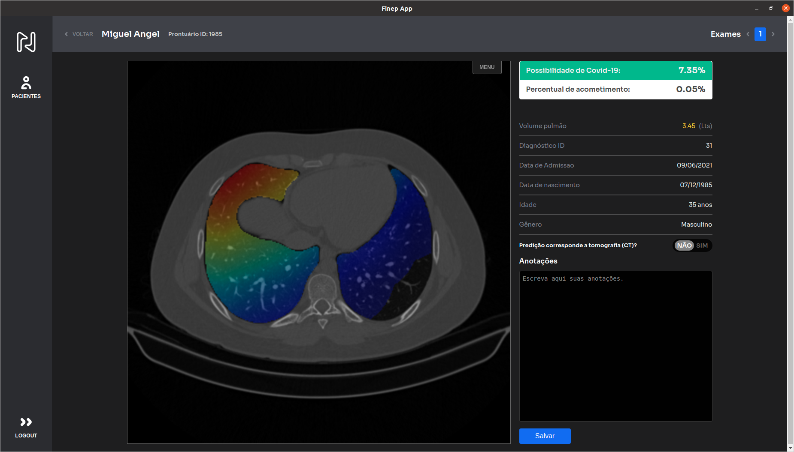

# NeuroRad.ai

## Clinical-radiological AI assisted decision support
### Providing AI assisted clinico-radiological decision support for ​COVID-19 pneumonia​.

## How it works
|             Step 1               |               Step 2                   |                Step 3                 |                Step 4                 |
| :--------------------------------: | :---------------------------------: | :---------------------------------: | :---------------------------------: |
| <strong>Load</strong> proper DICOM lung series​ | <strong>Fill out</strong> patient's medical record number​​ | <strong>Submit</strong> Computer Tomography for covid-19 scan​ | <strong>Review</strong> interactive results​​ |

## Features
 <ul>
    <li><i class="fas fa-check"></i> Probability estimation of COVID-19 pneumonia.</li>
    <li><i class="fas fa-check"></i> Lung involvement due COVID-19 pneumopathy.</li>
    <li><i class="fas fa-check"></i> Lung parenchyma volume estimation.</li>
</ul>
